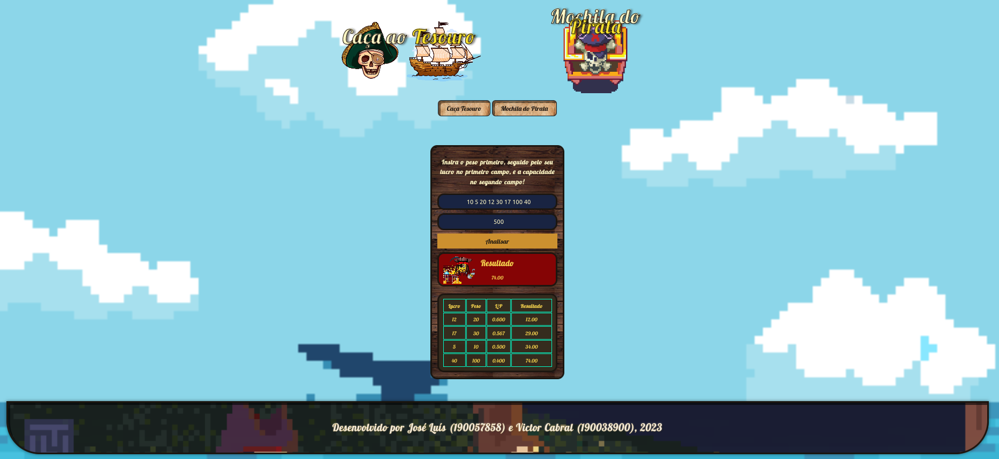
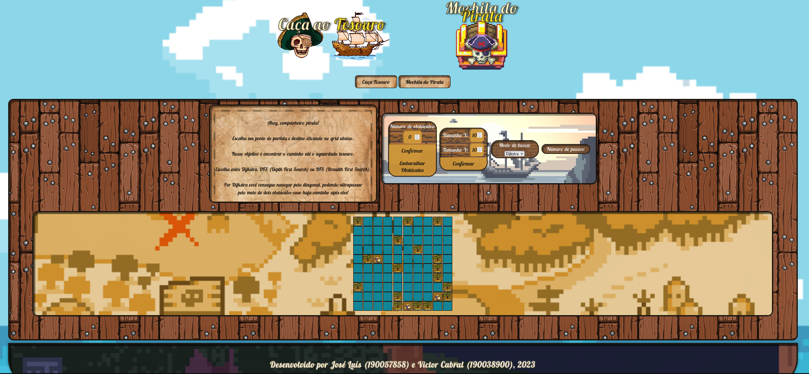
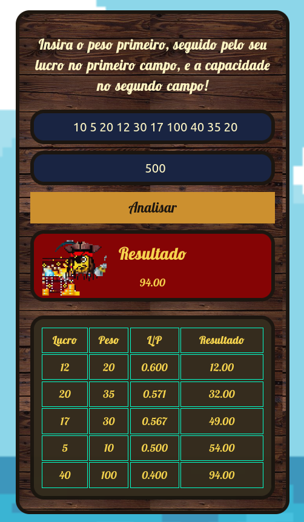
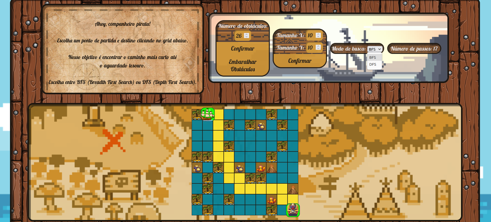
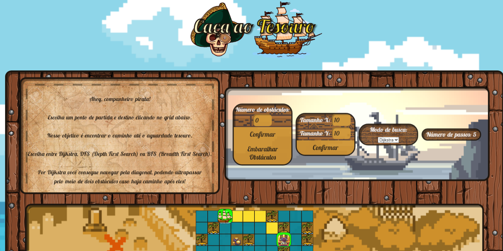

# Mochila do Pirata

**Número da Lista**: 37 
**Conteúdo da Disciplina**: Greed 

## Alunos
|Matrícula | Aluno |
| -- | -- |
| 19/0057858  |  José Luís Ramos Teixeira |
| 19/0038900  |  Victor de Souza Cabral |

## Sobre 
O código da "Mochila do Pirata" implementa o algoritmo clássico da Mochila, também conhecido como algoritmo do Knapsack. Esse algoritmo é amplamente utilizado em problemas de otimização combinatória, onde você precisa determinar a melhor combinação de itens para colocar em uma mochila, considerando restrições de capacidade. 

No caso do nosso projeto, a "mochila" do pirata seria justamente um baú, na qual ele deposita seu saque obtido nas navegações.

## Screenshots

## Vídeo de Apresentação (Greed)

**Conteúdo:** Knapsack.

Vídeo contendo explicação das modificações feitas para a entrega da unidade 3. Foco em apresentar as novidades implementadas. 

(Para melhor contexto do projeto em geral assistir o vídeo de apresentação complementar).

## Vídeo de Apresentação Complementar (Grafos 1 e 2)

Vídeo complementar contendo explicação da entrega feita para a unidade 1 e 2. 

**Conteúdo:** Depth First Search (DFS) ou Breadth First Search (BFS)

**Conteúdo:** Dijkstra.

## Instalação 
**Linguagem**: HTML, CSS e JavaScript 
**Framework**: Não há necessidade de instalar nenhum framework. Para rodar o projeto, basta clonar o repositório e abrir o arquivo index.html no navegador ou acessar o link. 

## Uso 
**Acessar o link:** <https://projeto-de-algoritmos.github.io/Greed_MochilaDoPirata/>

O usuário pode inserir itens com seus respectivos valores e pesos e determinar a capacidade da mochila. No final, o algoritmo retorna o valor máximo alcançado e a combinação de itens que o produz. Essas informações são exibidas na interface do usuário, mostrando o resultado da "Mochila do Pirata".

## Outros 
Este projeto foi criado como parte do curso de Projeto de Algoritmos da Fcauldade do Gama - Universidade de Brasília (FGA-UnB). Qualquer sugestão ou contribuição é bem-vinda.

